# Game Theory Multi Agent System Deployment
    Project Guide: Dr. Puduru Viswanadha Reddy 
    Project Members: 1.Harish Bhamitipadi Magesh
                     2.Ritabrata Mandal

:::info
This document is meant as a reference. Some details may change as the project evolves. Carefully verify assumptions and data before relying on any specific results or equations.
:::

## Index
1. Turtlebot3 Building and Deployment
2. Odometry Analysis
3. PID Control 
4. Regularised Inversion (Neural Network Model Training)
5. Localization
6. MarvelMind Setup

## Turtlebot3 Buidling and Deployment
Follow the official TurtleBot3 manual for Hardware Assembly.

[Turtlebot Hardware Assembly Link](https://emanual.robotis.com/docs/en/platform/turtlebot3/hardware_setup/#hardware-assembly)
#### Note
1. **Namespace** each TurtleBot3 uniquely so that topics on each robot (e.g., /cmd_vel, /odom) do not mix up with one another, such as
 (/tb3_1/cmd_vel, /tb3_2/cmd_vel,) etc.
2. All Turtlebots and the base station share the same wifi . Network congestion or disconnections can cause severe delays in teleoperation or data logging.
3. The more robots and modules you simultaneously run, the more likely you'll see Wi‑Fi bandwidth or CPU constraints.
4. Turtlebots deployed currently use ROS Noetic as their middleware.

#### System Limitations
1. For better performance, always use the turtlebot with about 80 percent of its original control inputs maximum value
2. The odometry data is constantly getting published by the encoder, so rewriting it is not possible.
3. Turtlebot's Odom Data are decentralized when used without LIDAR (limits to its own frame).

## Odometry Analysis 
The Solution from ODE is for an ideal world, which wouldn't match the data from the Turtlebot Odometry Data.
So we decided to run the simulations on Gazebo and test the fidelity of turtlebots to the simulation, then move on with doing it to actual turtlebots
___
#### Note
1. In this robot testbed, only encoders are used as a source of odom since the environment is devoid of obstacles. 
2. A Flat, Indoor Environment with minimal slippage is required for smooth functioning of turtlebots 
3. Odometry Data from Turtlebots and Gazebo were not matching, due to Real world Physics deviating from the Simulation. 
>So, We acquired the turtlebot odom data and fed the value to simulation, figured out various parameters that affects the simulation Physics and their relationship with Real world Physics, so they can be varied accordingly
___
Each TurtleBot has wheel encoders that measure rotation. This is used to compute linear and angular displacement.
Various Tests are being ran on the turtlebots, varying parameters such as	linear and angular velocities, surfaces. These tests are performed for both constant distance and constant time.

Assumption
: Minimal slippage and correct wheel radius.

Observation
: Real odometry typically diverges from "ideal" ODE or Gazebo simulations due to friction, slip, battery voltage fluctuations, or sensor noise.

___
A Study was conducted comparing the ODE Trajectory Data on MATLAB Simulation with Turtlebot's Odometry Data following the said Trajectory. The paramters that were varied for the study were:
1. Surface (Tile,Granite,Table,Mat)
2. Linear Velocity (0.05, 0.075, 0.1 ms)- accounts for encoder accuracy
3. Angular velocity (0.05, 0.075, 0.1 ms)- accounts for gyroscope accuracy
 
This experiment is being done keeping time as constant [IMAGES TO BE ADDED]

Based on this Study, Table and Mat were ruled out as possible surfaces since 
* Table seemed as an unlikely option since it produced less than average results in all three cases
* While the Mat worked really well for Case with just Linear Velocity, introducing angular velocity increased

:::danger
Keeping the duration constant during all the test cases led to the turtlebots covering different distances and leading to inconsistent results. Therefore a fixed distance is to be used in the test cases, to make sure that the error accumulated correctly corresponds to the specific velocity set irrespective of time driven.
:::
___
Then, the next Study was conducted comparing the ODE Trajectory Data on MATLAB Simulation with Turtlebot's Odometry Data following the said Trajectory. The paramters that were varied for the study were:
1. Surface (Tile,Granite,Table)
2. Linear Velocity (0.05, 0.075, 0.1 ms)- accounts for encoder accuracy
3. Angular velocity (0.05, 0.075, 0.1 ms)- accounts for gyroscope accuracy

This experiment is being done keeping distance as constant 

  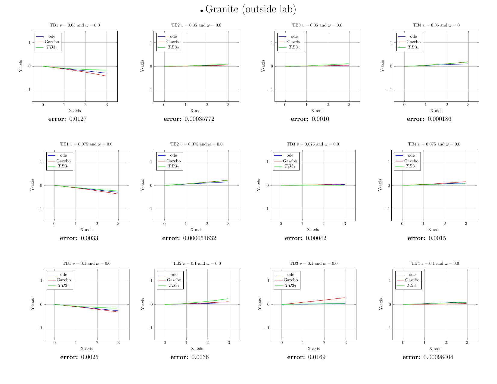
  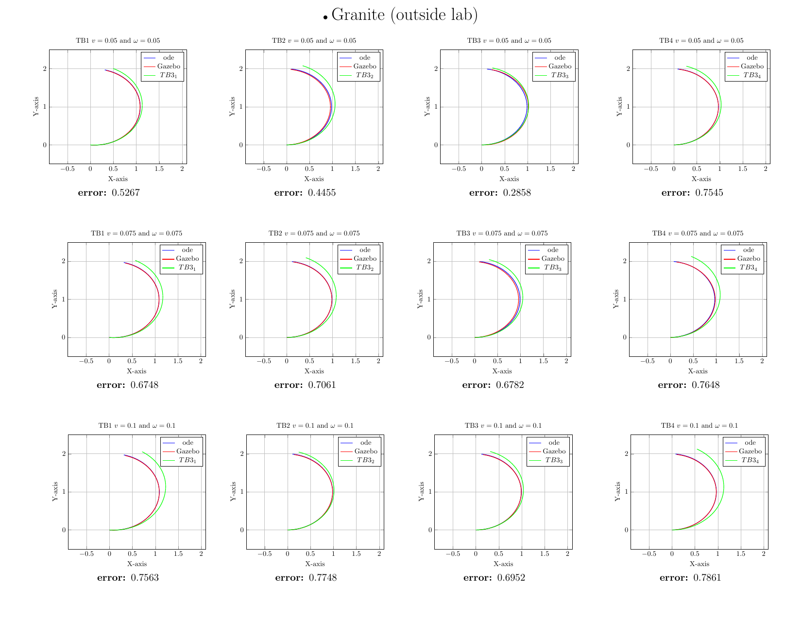

<em>Granite (outside lab) — linear velocity only (left) &nbsp;|&nbsp; with angular velocity (right)</em>

  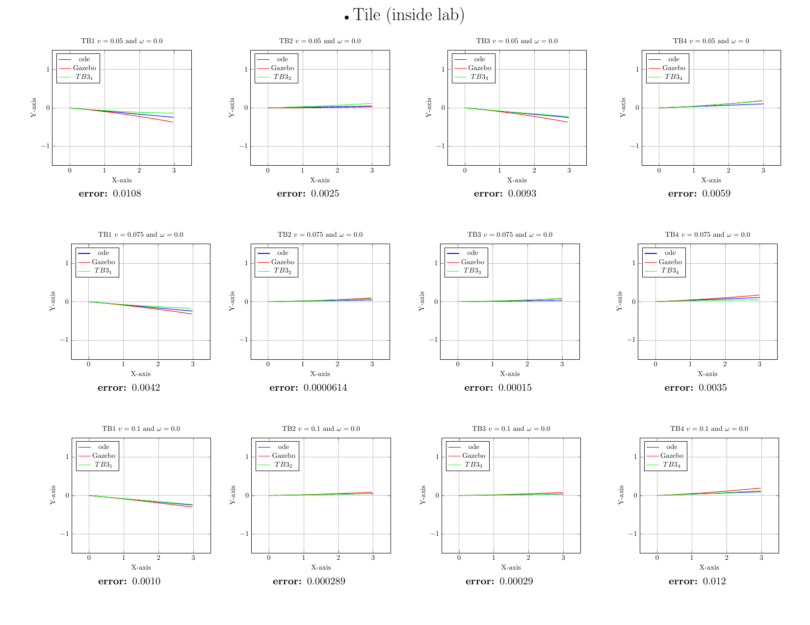
  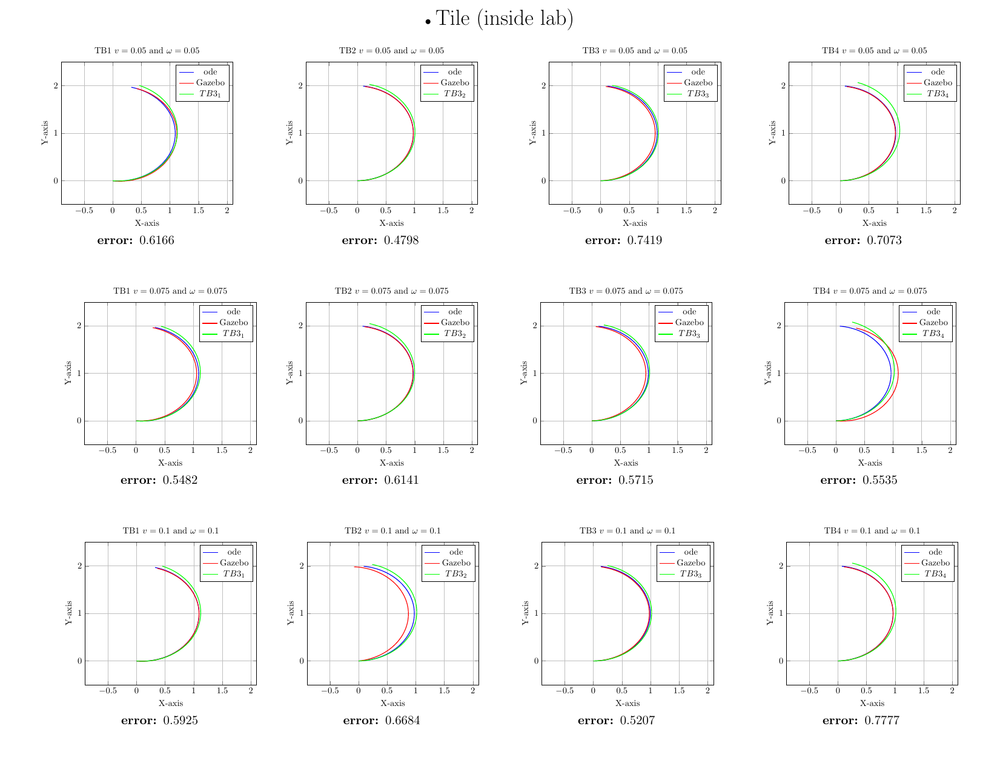

<em>Tile (inside lab) — linear velocity only (left) &nbsp;|&nbsp; with angular velocity (right)</em>

:::warning
MSE is not a standard way to check the error
The odometry error in these cases. So the proper way to check for errors is to calculate the error at the last position.
:::
___
>Meanwhile, a speculation was made to check how the odometry data from the turtlebot was being published. What if the odometry data from the turtlebot is inaccurate? This paved way to perform a study using custom odometry data.

A Study is conducted to check turtlebot odometry data by comparing it with custom odometry data calculated from turtlebot sensors

How Custom Odometry Is Calculated
: * Wheel Displacement : For both the real and simulated (Gazebo) TurtleBot, the code reads wheel positions from joint state messages. It calculates the incremental displacement for each wheel by multiplying the change in wheel encoder reading by the wheel's radius. The linear displacement $d_{center}$
is then computed as the average of the left and right displacements.

* Position Update :
The robot's new $x$ and $y$ positions are updated using:
$$ x_{new} = x_{old} + d_{center}.\cos\theta $$
$$ y_{new} = y_{old} + d_{center}.\sin\theta $$
where $\theta$ is the current orientation angle fetched from IMU

* Orientation Update :
Instead of integrating the angular velocity, the orientation is updated by taking the difference between the current IMU yaw angle and the initial IMU reading. For example, for the real robot:

$$ \theta_{new} = \theta_{old} + (\theta_{imu} - \theta_{intial})$$

A similar method is used for the Gazebo version.

  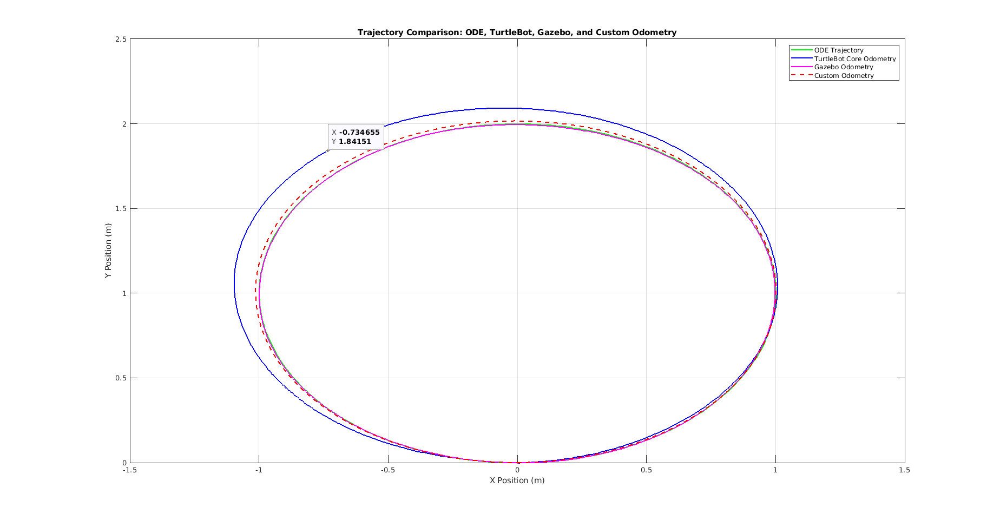

*Error between Custom Odometry and Gazebo*: 0.002237 meters

*Error between TurtleBot Core Odometry and Gazebo*: 0.26186 meters

The above plot contains multiple trajecteries which are:

1. An ODE simulation of the expected trajectory using the ideal kinematic model.
2. TurtleBot's core odometry from the robot's built-in sensors.
3. Gazebo's odometry.
4. Custom odometry for robot turtlebot.

:::warning
Turtlebot3's Gazebo Odom data seems to be performing better than Custom Odom when comparing them against robot position data from the gazebo (ground truth), to the point where Robot position data seems to be overwriting gazebo odom data while resetting the positions of the turtlebots in the gazebo setup, which demands the question of how odom is being calculated on the turtlebot_core, how this translates to real turtlebot setups with no ground truths, thereby where joint states data odom calc comes into play. (Also resetting the turtlebots position doesn't change the /joint state data on the turtlebots in gazebo and real setups).
:::
While the custom odometry approach is methodologically sound on first glance, its accuracy hinges on precise sensor synchronization and handling of inherent sensor noise. Some potential pitfalls to these assumptions are:

1. **Sensor Synchronization**:
The wheel encoder data (from joint states) and the IMU readings are received in separate calls. Any time lag or mismatch between these measurements can lead to inaccurate pose updates.

2. **IMU Noise and Drift**:
IMUs are susceptible to noise and drift. Relying directly on raw IMU orientation without filtering (e.g., using a complementary filter or Kalman filter) can introduce errors, especially over longer durations.

3. **Encoder Resolution and Quantization**:
The resolution of the wheel encoders might limit the accuracy of the computed incremental distances. Small errors in encoder measurements can accumulate over time.

4. **Simplistic Integration Method**:
The use of simple Euler integration for both position and orientation may not capture the dynamics accurately during rapid maneuvers or when non-linear effects (like wheel slippage) occur.

Without proper solutions to the above concerns, the custom odometry is ruled out as a possible solution even though it yields lesser position error (Custom odom doesnt respect ground truth in the hardware setup, where the ground truth is set through manual position mesurement)
___
So, after a detour towards exploring custom odometry and why it doesnt work, we conclude that perfect matches between real and simulated odometry are unachievable. However, bounding errors or reducing them enough for a given application is typically sufficient. These tests proved that there is no trouble with the sensor data, rather there is a need for proper control implementation.

## Regularized Inversion

## PID Control

**PID Velocity Control Trajectory Tracking**

  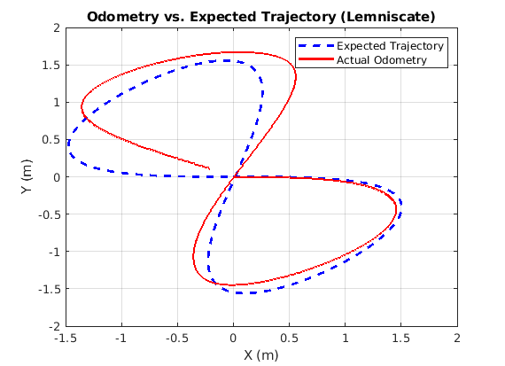
  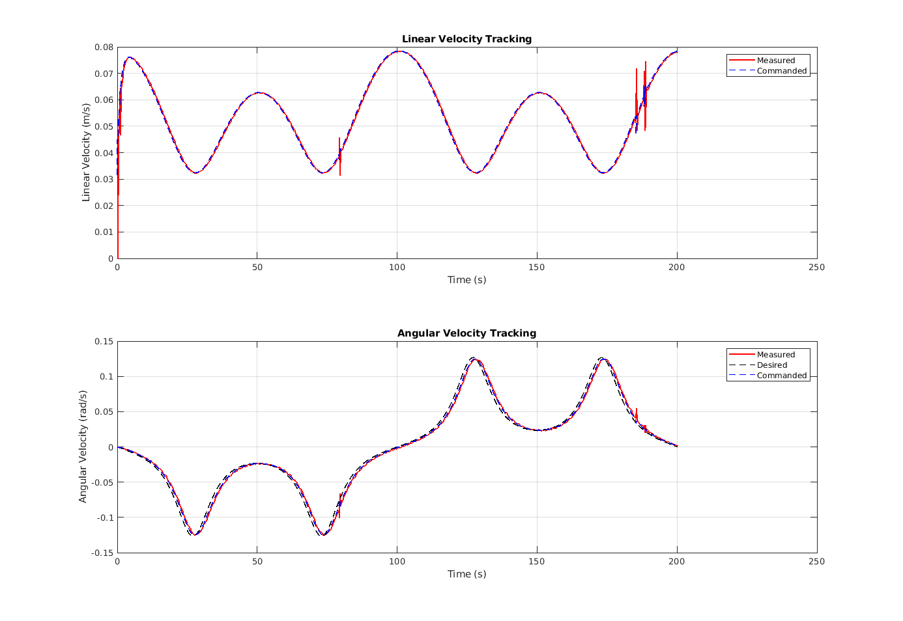

**PID Position Control Trajectory Tracking**

  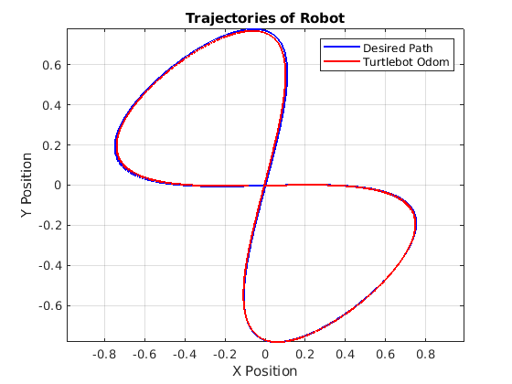
  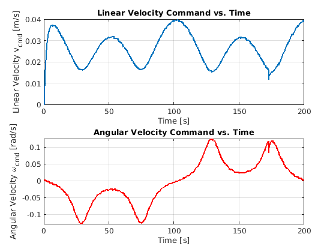

**PID Position Control Waypoint Tracking**

  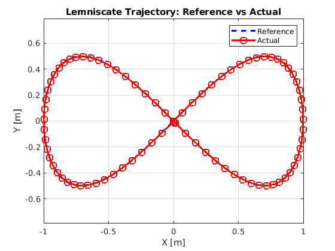
  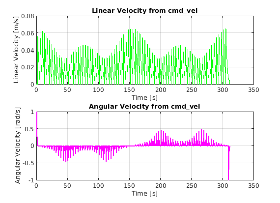

## Feedback Linearization

  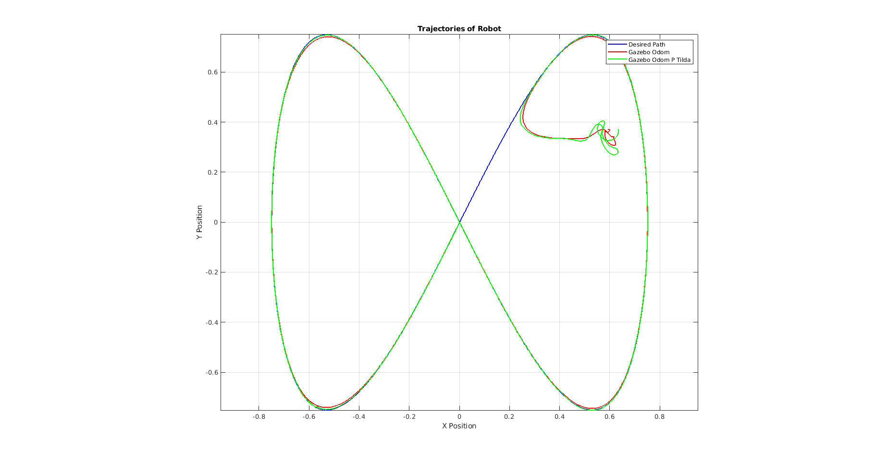

The L Value of Turtlbot is determined experimentally by varying it along with its starting positions 

L = -0.01;0.01;0.025;0.05;0.1;0.4

Starting Positions = (0,0);(0.5,0.2)

**1. L = -0.01**

  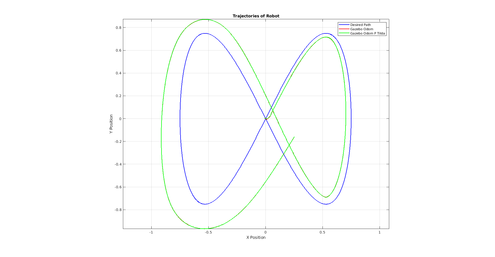
  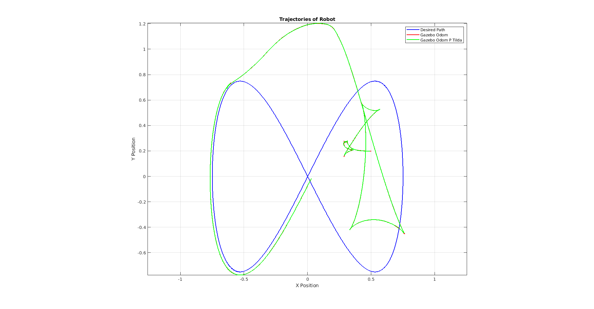

<em>a. Starting Position (0,0) &nbsp;&nbsp;&nbsp;&nbsp;&nbsp;&nbsp; b. Starting Position (0.5, 0.2)</em>

**2. L = 0.01**

  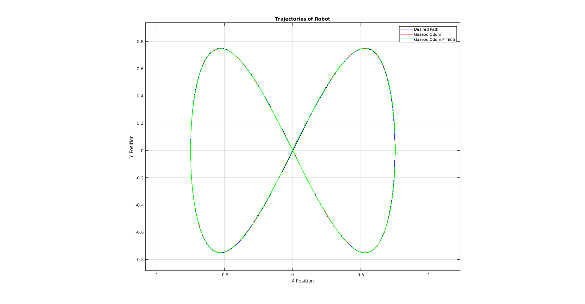
  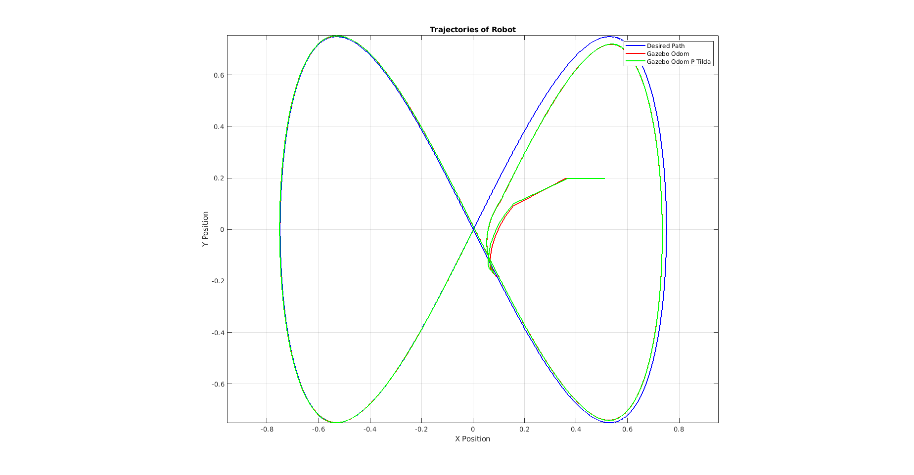

<em>a. Starting Position (0,0) &nbsp;&nbsp;&nbsp;&nbsp;&nbsp;&nbsp; b. Starting Position (0.5, 0.2)</em>

**3. L = 0.025**

  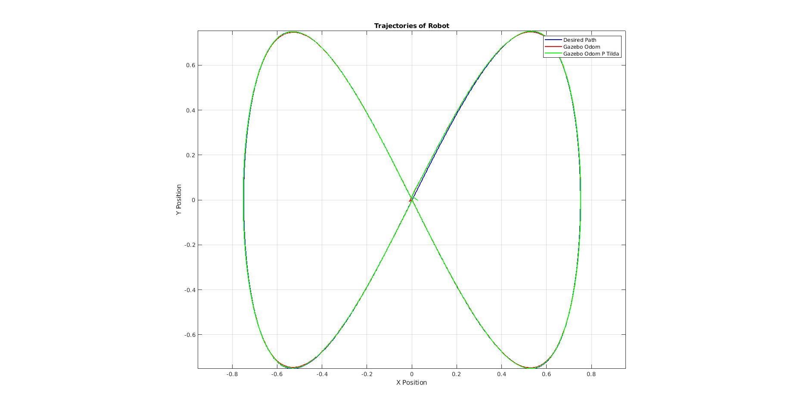
  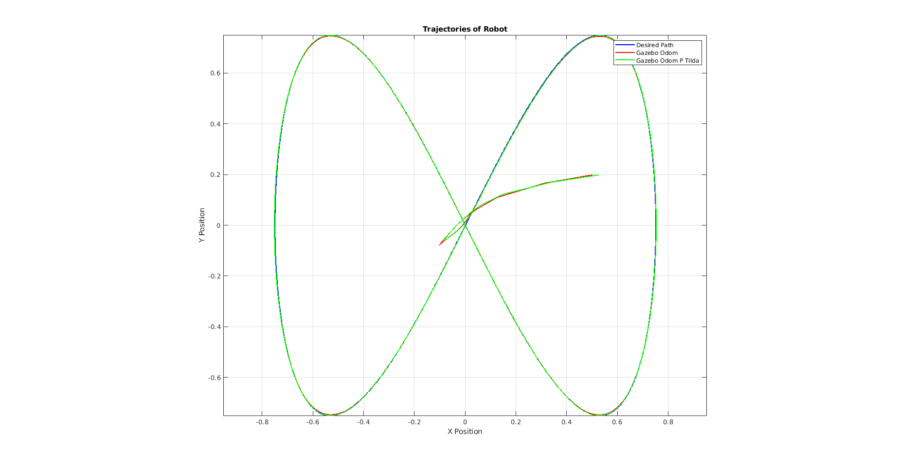

<em>a. Starting Position (0,0) &nbsp;&nbsp;&nbsp;&nbsp;&nbsp;&nbsp; b. Starting Position (0.5, 0.2)</em>

**4. L = 0.05**

  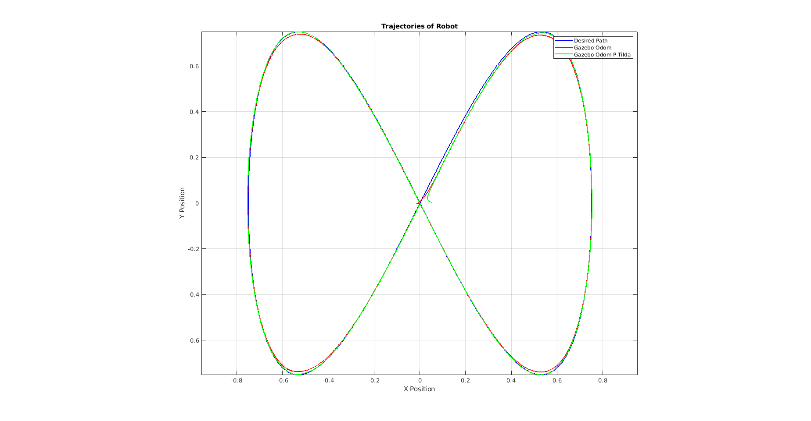
  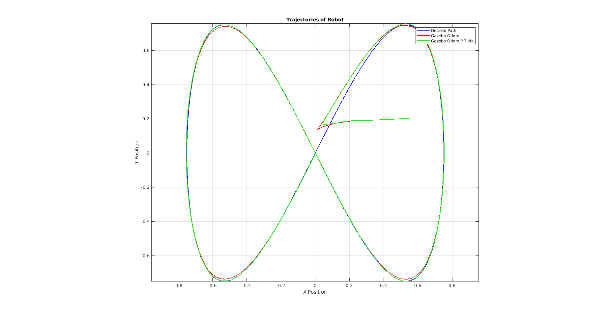

<em>a. Starting Position (0,0) &nbsp;&nbsp;&nbsp;&nbsp;&nbsp;&nbsp; b. Starting Position (0.5, 0.2)</em>

**5. L = 0.1**

  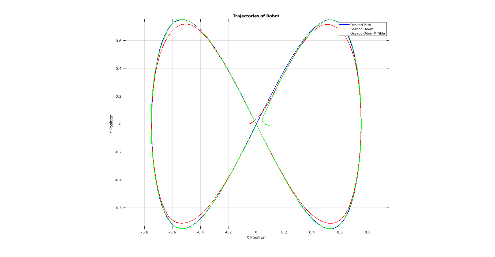
  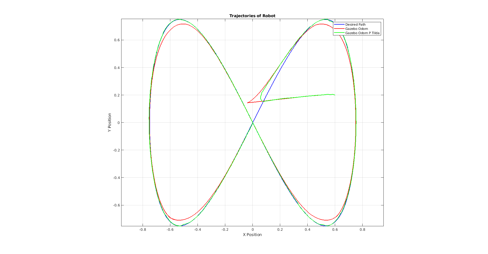

<em>a. Starting Position (0,0) &nbsp;&nbsp;&nbsp;&nbsp;&nbsp;&nbsp; b. Starting Position (0.5, 0.2)</em>

**6. L = 0.4**

  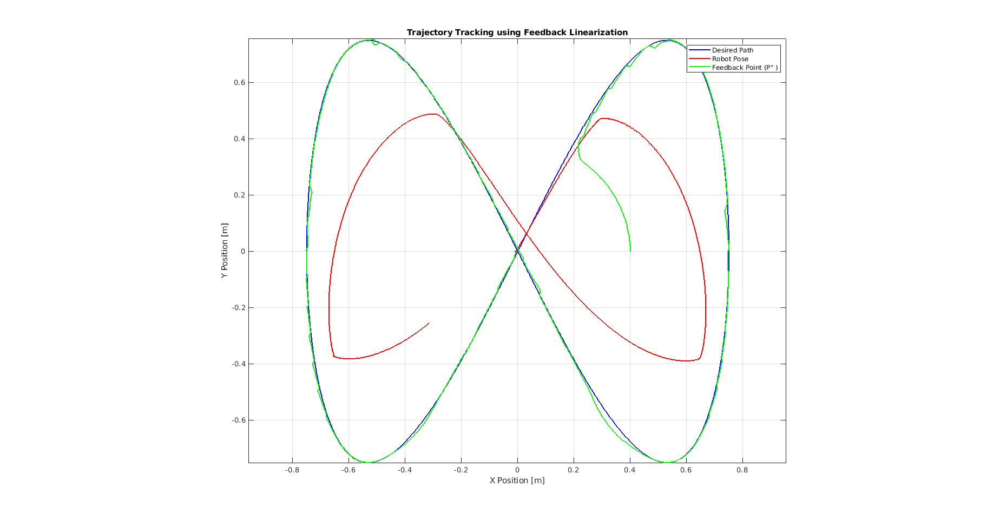
  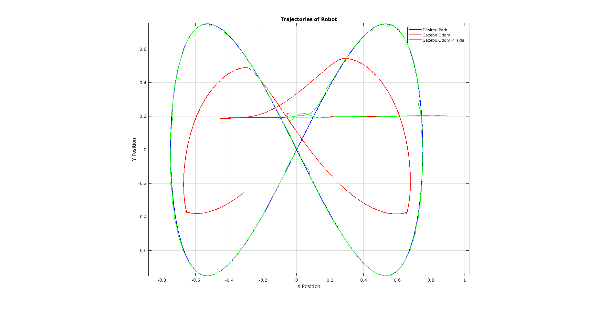

<em>a. Starting Position (0,0) &nbsp;&nbsp;&nbsp;&nbsp;&nbsp;&nbsp; b. Starting Position (0.5, 0.2)</em>

